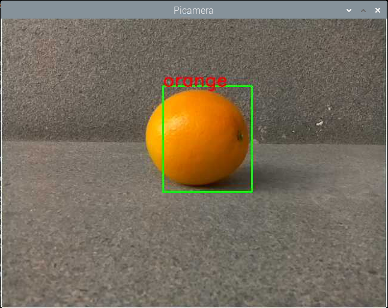

Color Detection
===============

Say a color and mark it in the field of view. This is not difficult for most humans, because we have been trained in this way since we were young.

For computers, thanks to deep learning, such tasks can also be accomplished. 
In this project, there is an algorithm that can find a certain color (6 kinds in total), 
such as finding "orange".

**Run the Code**

.. raw:: html

    <run></run>

.. code-block::

    cd /home/pi/vilib/examples
    sudo python3 color_detection.py

**View the Image**

After the code runs, the terminal will display the following prompt:

.. code-block::

    No desktop !
    * Serving Flask app "vilib.vilib" (lazy loading)
    * Environment: production
    WARNING: Do not use the development server in a production environment.
    Use a production WSGI server instead.
    * Debug mode: off
    * Running on http://0.0.0.0:9000/ (Press CTRL+C to quit)

Then you can enter ``http://<your IP>:9000/mjpg`` in the browser to view the video screen. such as:  ``https://192.168.18.113:9000/mjpg``

.. image:: img/display.png

**Code** 

.. code-block:: python

    #!/usr/bin/env python3
    from vilib import Vilib
    from time import sleep

    def main():

        Vilib.camera_start(vflip=False,hflip=False) #
        Vilib.display(local=True,web=True)
        Vilib.color_detect(color="red")  # red, green, blue, yellow , orange, purple
        sleep(1)
        # Vilib.detect_obj_parameter['color_x']    # Maximum color block center coordinate x
        # Vilib.detect_obj_parameter['color_y']    # Maximum color block center coordinate x
        # Vilib.detect_obj_parameter['color_w']    # Maximum color block pixel width
        # Vilib.detect_obj_parameter['color_h']    # Maximum color block pixel height
        # Vilib.detect_obj_parameter['color_n']    # Number of color blocks found

        while True:
            n = Vilib.detect_obj_parameter['color_n'] 
            print("%s color blocks are found"%n, end=',', flush=True)
            if n != 0:   
                w = Vilib.detect_obj_parameter['color_w']
                h = Vilib.detect_obj_parameter['color_h']
                print("the maximum color block pixel size is %s*%s"%(w,h))
            else:
                print('') # new line
            sleep(0.5)

    if __name__ == "__main__":
        main()

**How it works?**

The first thing you need to pay attention to here is the following function. These two functions allow you to start the camera.

.. code-block:: python

    Vilib.camera_start(vflip=True,hflip=True) 
    Vilib.display(local=True,web=True)

Functions related to "color detection":

* ``Vilib.color_detect(color)`` : For color detection, only one color detection can be performed at the same time. The parameters that can be input are: ``"red"``, ``"orange"``, ``"yellow"``, ``"green"``, ``"blue"``, ``"purple"``
* ``Vilib.color_detect_switch(False)`` : Switch OFF color detection

The information detected by the target will be stored in the ``detect_obj_parameter = Manager().dict()`` dictionary.

In the main program, you can use it like this:

.. code-block:: python

    Vilib.detect_obj_parameter['color_x']

The keys of the dictionary and their uses are shown in the following list:

* ``color_x``: the x value of the center coordinate of the detected color block, the range is 0~320.
* ``color_y``: the y value of the center coordinate of the detected color block, the range is 0~240.
* ``color_w``: the width of the detected color block, the range is 0~320.
* ``color_h``: the height of the detected color block, the range is 0~240.
* ``color_n``: the number of detected color patches.