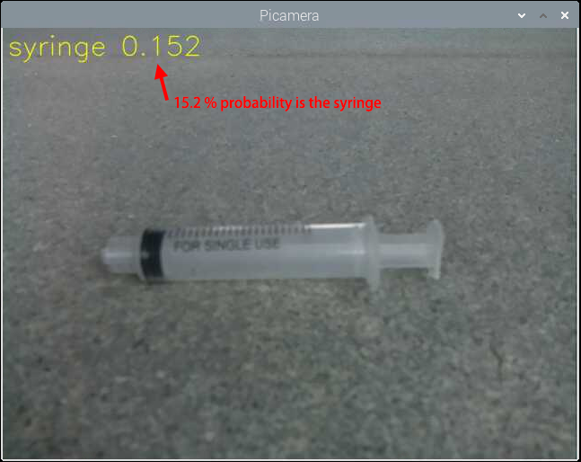
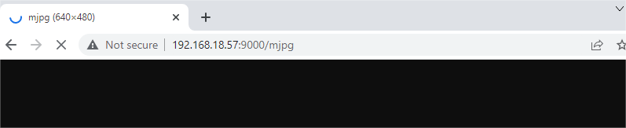

Image Classification
====================

When you see a rabbit, you will directly say its name. The computer will tell you that 91% of it may be a rabbit, 4% of it may be a cat, 3% of it may be a dog, and 2% of it may be something else.

We use image classification to reveal the cognitive model of computer vision. Image classification is a basic task. A trained model is used to identify images representing various objects, and then the images are assigned to specific tags to classify the images.

**Run the Code**

.. raw:: html

    <run></run>

.. code-block::

    cd /home/pi/vilib/examples
    sudo python3 image_classification.py

**View the Image**

After the code runs, the terminal will display the following prompt:

.. code-block::

    No desktop !
    * Serving Flask app "vilib.vilib" (lazy loading)
    * Environment: production
    WARNING: Do not use the development server in a production environment.
    Use a production WSGI server instead.
    * Debug mode: off
    * Running on http://0.0.0.0:9000/ (Press CTRL+C to quit)

Then you can enter ``http://<your IP>:9000/mjpg`` in the browser to view the video screen. such as:  ``https://192.168.18.113:9000/mjpg``

**Code** 

.. code-block:: python

    from vilib import Vilib

    def main():
        Vilib.camera_start(vflip=False,hflip=False)
        Vilib.display(local=True,web=True)
        Vilib.image_classify_set_model(path='/home/pi/vilib/mobilenet_v1_0.25_224_quant.tflite')
        Vilib.image_classify_set_labels(path='/home/pi/vilib/labels_mobilenet_quant_v1_224.txt')
        Vilib.image_classify_switch(True)

    if __name__ == "__main__":
        main()

**How it works?** 

The use of this feature is very simple. You only need to pay attention to the following three lines of code:

* ``Vilib.image_classify_set_model(path)`` : Load the trained model file.
* ``Vilib.image_classify_set_labels(path)`` : Load the corresponding label file.
* ``Vilib.image_classify_switch(True)`` : Start the image classifier.

Here, we directly use `Tensorflow pre-trained model <https://www.tensorflow.org/lite/guide/hosted_models#image_classification>`_, which is an image classification model that includes thousands of objects.
You can open the label file (``/home/pi/vilib/labels_mobilenet_quant_v1_224.txt``) to see which objects are included.

In addition to the built-in models in this article, you can also download the pre-trained image classification model on `TensorFlow Hub <https://tfhub.dev/tensorflow/collections/lite/task-library/image-classifier/1>`_. It should be noted that these models may not be suitable for your project, please use them as appropriate.

If you want to try to create your own model. We strongly recommend that you use `Teachable Machine <https://teachablemachine.withgoogle.com/>`_. It is a web-based tool that allows everyone to create machine learning models quickly, easily, and accessible. Please click Get start on the webpage to start training your model.

.. note:: Raspberry Pi may not be able to use Teachable Machine smoothly. You will need to prepare a PC or laptop equipped with a camera.

**Model Training**

1. Open `Teachable Machine <https://teachablemachine.withgoogle.com/>`_, you will see an obvious Get Start on the web page, click on it.

    .. image:: img/tm1.png

2. Select Image Project (Audio Project and Pose Project are not applicable here). You will be prompted to choose Standard image model or Embedded image model. The former has a higher accuracy rate and the latter has a faster speed. We recommend choosing the first one.

    .. image:: img/tm2.png

    .. image:: img/tm3.png

3. Train the model. Teachable Machine provides a detailed video step-by-step explanation, please see:

    .. raw:: html

        <iframe width="640" height="360" src="https://www.youtube.com/embed/DFBbSTvtpy4" title="YouTube video player" frameborder="0" allow="accelerometer; autoplay; clipboard-write; encrypted-media; gyroscope; picture-in-picture" allowfullscreen></iframe>

    .. note:: The video after 0:55 is the content of the other two projects and is not applicable here.

    .. raw:: html

        <iframe width="640" height="360" src="https://www.youtube.com/embed/CO67EQ0ZWgA" title="YouTube video player" frameborder="0" allow="accelerometer; autoplay; clipboard-write; encrypted-media; gyroscope; picture-in-picture" allowfullscreen></iframe>

    .. raw:: html

        <iframe width="640" height="360" src="https://www.youtube.com/embed/n-zeeRLBgd0" title="YouTube video player" frameborder="0" allow="accelerometer; autoplay; clipboard-write; encrypted-media; gyroscope; picture-in-picture" allowfullscreen></iframe>

    .. note:: 

        The export settings applicable to this project are shown in the figure:

        .. image:: img/tm4.png

4. Unzip the downloaded zip file, you will be able to see the `model file` and `label file`, their formats are ``.tflite`` and ``.txt`` respectively. Use **Filezilla Software** to copy them to the ``/home/pi/vilib/`` directory of the Raspberry Pi.

5. Modify the two lines of the sample code in this article, and change them to your model and label.

    .. code-block:: python

        Vilib.image_classify_set_model(path='/home/pi/vilib/your_model.tflite')
        Vilib.image_classify_set_labels(path='/home/pi/vilib/your_label.txt')

6. Re-run the example. It will recognize the objects in your training model.