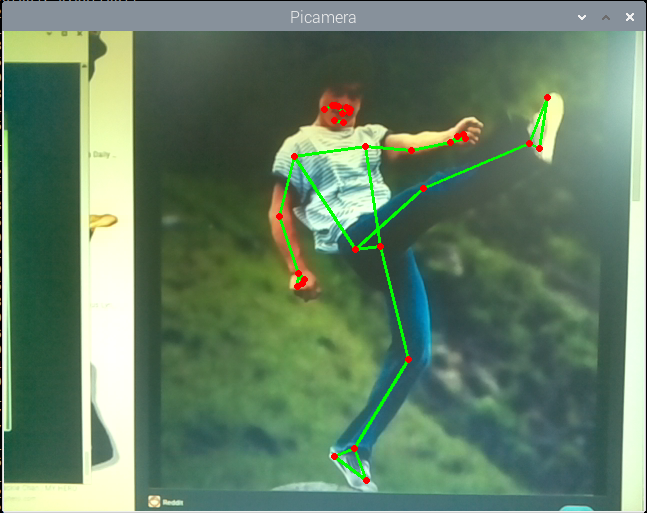

Pose Detection
==========================

Like hand detection, posture detection is also part of the field of human-computer interaction. It can be used to judge action instructions, identify dances, quantify exercises and other scenes.

In this project, you will see that the human body in front of the camera is recognized and the coordinates of the left wrist are printed.

**Run the Code**

.. raw:: html

    <run></run>

.. code-block::

    cd /home/pi/vilib/examples
    sudo python3 pose_detection.py

**View the Image**

After the code runs, the terminal will display the following prompt:

.. code-block::

    No desktop !
    * Serving Flask app "vilib.vilib" (lazy loading)
    * Environment: production
    WARNING: Do not use the development server in a production environment.
    Use a production WSGI server instead.
    * Debug mode: off
    * Running on http://0.0.0.0:9000/ (Press CTRL+C to quit)

Then you can enter ``http://<your IP>:9000/mjpg`` in the browser to view the video screen. such as:  ``https://192.168.18.113:9000/mjpg``

.. image:: img/display.png

**Code**

.. code-block:: python

    #!/usr/bin/env python3
    from vilib import Vilib

    def main():
        
        Vilib.camera_start(vflip=False,hflip=False)
        Vilib.display(local=True,web=True)
        Vilib.pose_detect_switch(True)

    if __name__ == "__main__":
        main()

**How it works?** 

This function has been encapsulated in the ``vilib`` library, execute ``Vilib.pose_detect_switch(True)`` to start gesture detection.

The information detected by the target will be stored in the ``Vilib.detect_obj_parameter['body_joints']`` .

The three-dimensional coordinates of the 33 joints of the hand are stored here, such as the ``joints[15]`` printed in this article, which is the coordinates of the left wrist. The serial numbers of all joints are shown in the figure below.

.. image:: img/pose_tracking_full_body_landmarks.png

The coordinates of these joints are composed of [x,y,z,visiblity]. x and y are normalized to 0.0 ~ 1.0 by the width and height of the image (rather than the specific pixel position), the upper left corner of the screen is [0.0, 0.0], and the lower right corner is [1.0, 1.0].

The z coordinate represents the depth, with the crotch (between 23 and 24) depth as the origin. The smaller the value, the closer the landmark is to the camera. The size of z uses roughly the same ratio as x. visibility is a value indicating the possibility that the joint is visible (existing and not occluded) in the image, and its range is between 0.0 and 1.0.

This feature is based on `MediaPipe Google <https://mediapipe.dev/>`_, please see more knowledge in `Pose - MediaPipe <https://google.github.io/mediapipe/solutions/pose.html>`_ .